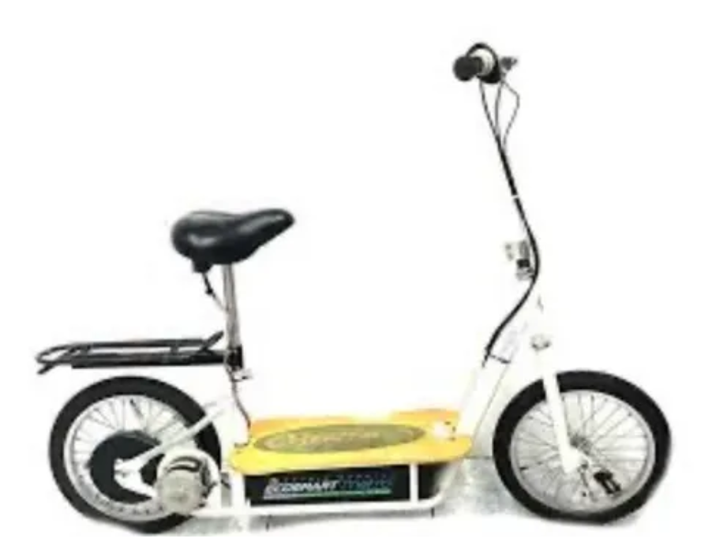

## Ecosmart Razer Metro Scooter

This repository is to capture the improvements and upgrades made to the Ecosmart Razor Metro scooter pictured above.  Having received this machine several years after it was purchased and then imemdiately stored, it was largely stock when it arrived in my care.

Within weeks, the Lead Acid Batteries went bad -- a known issue with this particular hardware.  A new 48v Lithium ION battery pack of 20,000mh was obtained via Alibaba, a tidy $40 off the same hardware listed with Amazon.  It was shipped from a US-based battery provider leading me to wonder if this is just another place where Amazon is charging American consumers increased prices with little to no one seeming to care stateside.

Following the upgrade to the battery, the motor was friend due to my riding the scooter up a somewhat challenging hill.  Within a week, magic smoke was pillowing from the 500w stock motor leading this upgrade advanture to its next target :: the Motor!

A 2000w 48V motor was acquired, a notable improvement over the stock rated motor and speed module -- acquired as part of a kit along with a new throttle that has a more granular battery charge indicator to advance us beyond the "Full / Low" indications that are standard on this scooter model.  It also comes along with a key security device which should assist with some of the issues encountered when the entire bike was enabled with a simply flip of the On/Off switch.  

## Future Expansions

New battery cover has been designed to enable us to add a second 48v 20,000wh LION battery, with the two 48v batteries setting on their side, and the 2000w module/controller setting atop the dual battery pack postured alongside the side.  This means that the same battery cover design + 55mm of space were added to the top of the design, however between the maximum top speed of 50 mph, the added features of the speedometer, turn signals, lighting all in accordance with making the machine a fully street legal piece of equipment -- the scooter is consistent with the < 50cc gas powered mopeds all while even featuring the enhancements that you'd desire and expect out of a fully licensed and legal motorcycle even while not fully requiring such as per local laws and regulations.
