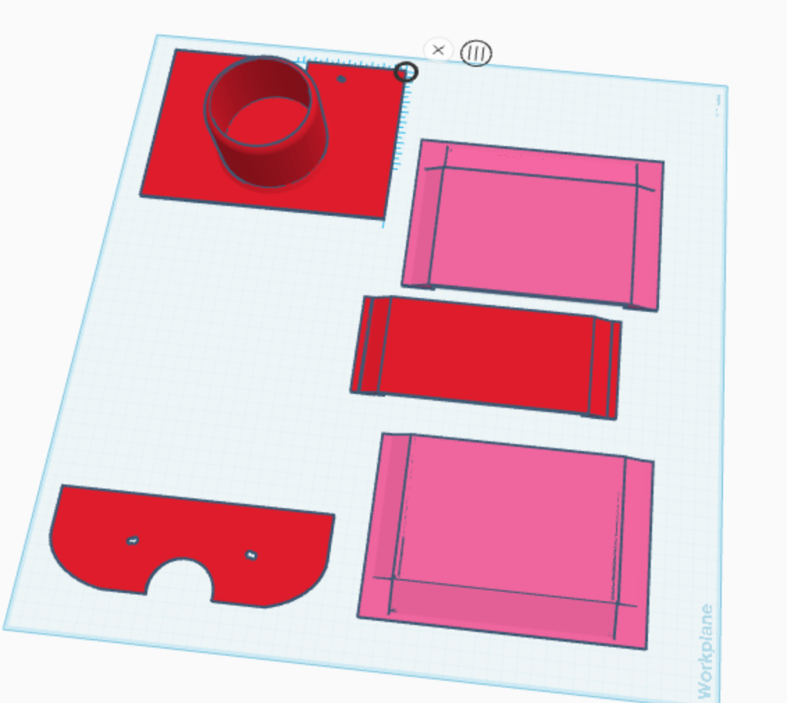

## Resources

The files found under this folder are resources that are intendeds for FDM 3D printing.   Specifically these files are produced using PETG predominently for its ruggedness and the intended outdoor and temperature sensitive environments it is anticipated these prints and the underlying scooter will find itself.  THese prints are also expected to be capable of withstanding some modest uses such as standing upon the part as its being used as the base-board (i.e. replacement of the wooden 'Razor' board as shown on the main page's graphic).

Further detail pertaining to these printed models and their uses are expected to follow.  Initial designs of this base-plate were done to house the upgrade from a 36V battery set (3 lead acid batteries) into a single 48V Lithium Ion batterypack.  This upgrade found it necessary to upgrade the motor immediately following the battery upgrade which saw us also taking the opportunity to go from a 500 watt motor to a 2000 watt motor, along with the expected hardware and gear surrounding such an upgrade such as a key-based system so that we could steer clear of the simple "On/Off" switch and the rather "dumb" power connection.  

## Battery Cover printed

I've started my customization process by removing the stock wooden battery cover panel and replacing it with a 3D printed PETG cover that is designed to house a 48V 20ah Lithium Ion battery pack.  This new battery cover is designed to fit the larger battery while also providing additional space for the upgraded motor controller unit that comes along with the 2000w motor upgrade.

I've continued to improve upon and refine the print, adding a cupholder to the base that finds itself right beneath the seat, allowing for convenient storage of a beverage while riding.  The cupholder is designed to securely hold a standard-sized cup or bottle, ensuring it stays in place during the ride.  I've created a few different models of the battery cover including a flat panel, then one that has a slight 15mm increase for space above the increased size of the battery + larger controller on account of the larger 2000w motor.  I've also created the design for a version that would fit two 48v 20ah batteries side by side which finds itself with a bulge up of ~55mm to house the two batteries side by side, and resting upon their sides with the controller setting atop the two batteries spines.

### Short Battery Cover Files

There are 4 files associated with the short battery cover design with one file needing to be printed twice to produce the end components of the battery cover part that "tents" up a bit to allow room for the larger battery and controller.

- [batterycover-short-beginning.stl](batterycover-short-beginning.stl)
- [batterycover-short-tentendx2.stl](batterycover-short-tentendx2.stl) (x2)
- [batterycover-short-tentmiddle.stl](batterycover-short-tentmiddle.stl)
- [batterycover-cupholder-end.stl](batterycover-cupholder-end.stl)

Underneath this cover the battery is placed facedown inside the carriage, then padding is added around the battery to protect it from bumps and vibrations during rides.  The controller is then placed atop the battery with sufficient clearance ensured by the tented portion of the battery cover.

### Dual Battery Cover Files
There are 4 files associated with the dual battery cover design with one file needing to be printed twice to produce the end components of the battery cover part that "tents" up a bit to allow room for the larger battery and controller.
